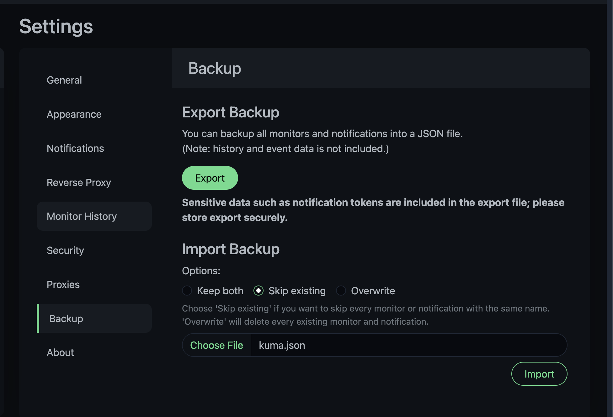
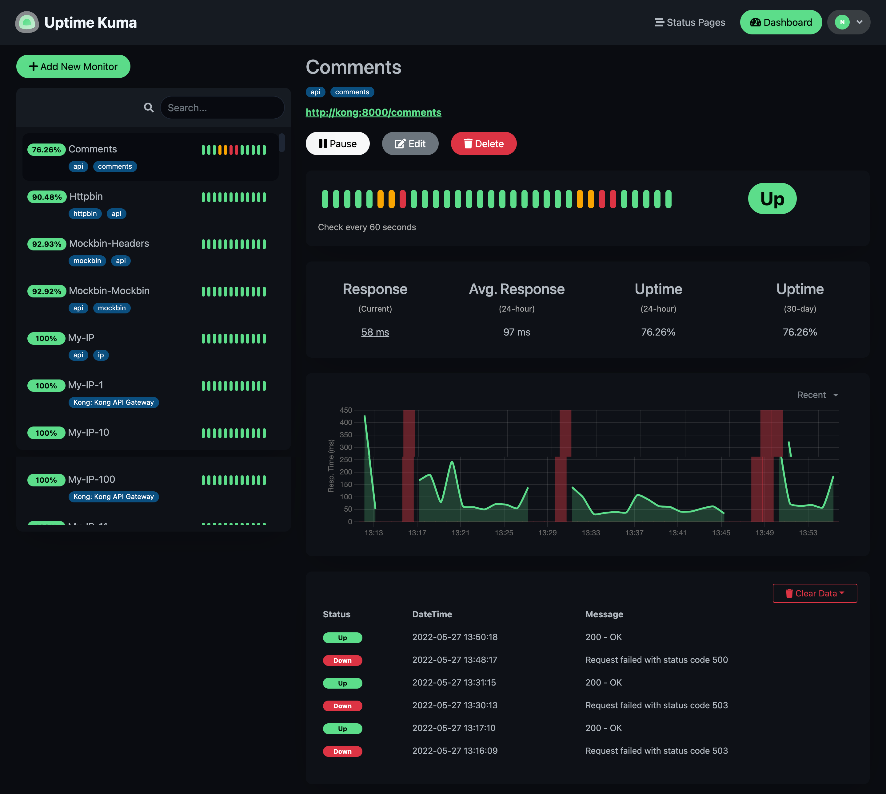

# Uptime Kuma Kong routes exporter

## Requirements

```
pip install argparse requests
```

## Usage

```
usage: uptime-kuma-kong-exporter.py [-h] [--kong-admin KONG_ADMIN_URL]
                                    [--out OUTPUT_FILE] [--color TAG_COLOR]
                                    [--dns DNS_SERVER]
                                    [--statuscodes STATUSCODES [STATUSCODES ...]]
                                    [--https]

Uptime Kuma Kong exporter

optional arguments:
  -h, --help            show this help message and exit
  --kong-admin KONG_ADMIN_URL
                        kong admin api url
  --out OUTPUT_FILE     output file name [JSON]
  --color TAG_COLOR     tag color in HEX #rrggbb
  --dns DNS_SERVER      dns resolver server
  --statuscodes STATUSCODES [STATUSCODES ...]
                        accepted status codes
  --https               use https for url

```

## Example

```
python uptime-kuma-kong-exporter.py --kong-admin http://admin.konghq.com --out kuma.json
```

## Import

Go to **`Uptime Kuma Dashboard > Settings > Backup > Choose File > Import`**



